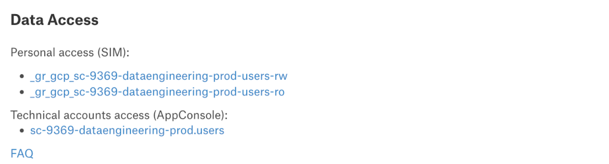

# **Instrukcja analityka**


## 7 przykazań analityka Nyks


W codziennej pracy nie zapominaj o:

1.  Umieszczaniu kodu, wyników i opisów w zadaniu na kolejce JIRA. Pamiętaj, że możesz podlinkować swój pull request na Github poprzez funkcje link → web link (więcej przeczytaj poniżej)

2. Odpowiednim tagowaniu tabel które produkujesz zgodnie z zasadami GDPR

3. Dodawaniu raportów cyklicznych i narzędzi do Raporty cykliczne oraz [przelotki raportowej MEX-ANA](https://lookerstudio.google.com/u/0/reporting/1VGawuO6c34MJIG5t2jwVyq8JbVmlS-bG/page/dBiVB)

4. W przypadku Looker Studio odświeżania front-endu przy użyciu użytkownika technicznego oraz nadawania dostępu “edit” dla całego zespołu “fin-mex-analytics”

5. W przypadku raportów Tableau poinformowaniu użytkowników o procedurze otrzymania dostępu do danych - więcej przeczytaj poniżej

6. Umieszczanie wyników analiz ad-hoc - jeśli są plikami płaskimi na zespołowym [dysku](https://drive.google.com/drive/folders/1UciAwf4fbLdnmncBdUfNa4Iov4nfSD9p)

7. Umieszczanie najciekawszych i rozbudowanych analiz produktowych na stronie [Product Analytics](https://product-analytics.allegrogroup.com/)


## Grupy SIM

Aby rozpocząć pracę należy zobaczyć, czy do Twojego konta są dodane wszystkie dostępy.
Spis najbardziej potrzebnych grup znajdziesz w tym linku: [link](https://docs.google.com/spreadsheets/d/142sekDFZpIqrBoL5D1td8dLt23a_zOIR/edit#gid=981157312).

Do grup możesz się dodać klikając na tę stronę - [link](https://sim.allegrogroup.com/IdentityManagement/default.aspx), a następnie klikając w panelu po lewej stronie Grupy → moje członkostwo w grupach. Wystarczy, że skopiujesz nazwę grupy i wkleisz ją u góry w pasku wyszukiwania. Najlepiej dodawać grupy z końcówką manual. Do grupy dodajemy się poprzez zaznaczenie checkboxa przy odpowiedniej nazwie i kliknięcie u góry dołącz do grupy. UWAGA ! aby dodać się do grupy pamiętaj zawsze podać uzasadnienie, dlaczego chcesz dołączyć do grupy. Prośby bez podanego uzasadnienia są odrzucane. Prośba o dołączenie widoczna będzie w pasku po lewej stronie Żądania i zatwierdzenia → Zarządzaj moimi 	zatwierdzeniami.

### Udostępnianie danych osobom z innych zespołów

- _gr_data_insiders  - osoby, które chcą mieć dostęp do przeglądania danych o GMV/revenue muszą wnioskować o dostęp do tej grupy; oznakowanie dokumentów/raportów oznacza dane wrażliwe finansowe i musi być oznakowane też tagiem: has_confidential_data
- _gr_3p_all - grupa dotyczy wszystkich osób, którzy są w Allegro pl, nie mają wglądu do danych wrażliwych finansowych

#### Tableau
Obecnie nie trzeba składać już requestów o dostęp do Tableau. Wystarczy dodać się do grup - [link](https://sim.allegrogroup.com/IdentityManagement/aspx/Groups/AllGroups.aspx?searchtype=54aa2b42-1192-4e8c-995c-3ddf5fa07040&content=_gr_tableau_data_insiders_Allegro) (dane poufne, takie jakie znajdują się w site Finance).
Jeśli chodzi o sam dostęp do Tableau to od grudnia 2023: 
- [x] każdy kto jest członkiem grupy _gr_tableau_access (która dziedziczy z _gr_3p_all or _gr_3p_AllegroPay, czyli każdy kto jest 3P  ma dostęp do Tableau. 
- [x] licencja Viewera jest nadawana przy logowaniu się do Tableau
odbierana jest po 7 dniach nieaktywności
- [x] przy kolejnej próbie logowania jest automatycznie przywracana. Dotyczy to wszystkich site'ów
- [x] proces odbierania i nadawania licencji jest praktycznie niezauważalny dla zwykłego użytkownika.
[Formularz dostępowy](https://srtool.allegrogroup.com/pl/employee_request/new/69656) do Tableau zostanie zmieniony i będzie dotyczyć tylko ról Creatora.

## GCP i Airflow
[Konsola Big Query](https://console.cloud.google.com/bigquery?project=sc-10231-finance-bq-prod&pli=1&ws=!1m0) - pracujemy na 2 projektach: sc-10231-finance-bq-prod (produkcja) i sc-10231-finance-bq-dev (test).

[Airflow produkcyjny](https://f6fd957b607346e69107d95fa49dbe15-dot-europe-west1.composer.googleusercontent.com/home)

[Airflow testowy](https://0dc6ec58d143421b8be0fc52d32f0f79-dot-europe-west1.composer.googleusercontent.com/home?tags=debt-collection)

## Tabele

### Spis tabel
Spis najbardziej popularnych i wykorzystywanych tabel w zespole można znaleźć w tym linku: [link](https://docs.google.com/spreadsheets/d/142sekDFZpIqrBoL5D1td8dLt23a_zOIR/edit#gid=1116399558). 
W Allegro wciąż udoskonalana jest ogólna wiedza na temat tabel. W [Alation](https://alation.allegrogroup.com/) po wpisaniu nazwy tabeli uzyskasz wiedzę na temat schematów tabel, opisów kolumn, a najważniejsze na temat grup w SIM, do których należy się dodać, aby móc z danej tabeli korzystać. Wiedza ta znajduje się w części Data Access:

<figure markdown>{ width="800"} </figure>

Staramy się na bieżąco opisywać nasze najważniejsze tabele zespołowe. Niektóre opisy można znaleźć pod tym linkiem: link.

## Tagowanie tabel
W związku z RODO i prowadzoną polityką w Allegro zwracamy szczególną uwagę, aby każda tabela na GCP była otagowana. Szczegółowe informacje na temat tego procesu znajdziesz w poniższych linkach:

[GDPR process of describing data sets](https://docs.google.com/document/d/1moxc383WdK5tfGVizS6qLmpuWzw0_VwOEP49HlIJA4E/edit)

[Data processing rules for analysts](https://docs.google.com/document/d/1SnT9NxVXIuOUpPx2TFuTYDWlhJIyQm-YdVUGIMJn_oA/edit#heading=h.qsvukbr3p4gk)

[RODO Alation](https://alation.allegrogroup.com/article/162/)

Przykład 1 użycie kodu na utworzenie tabeli bez określenia czasu wygaśnięcia plus dodanie labelek

```py
CREATE TABLE
 `sc-10231-finance-bq-dev.finance.nyks_629_fee_deduction_users_with_active_process_sierpien`
PARTITION BY v_date
OPTIONS
(
 description = '',
 labels = [('allegro__pers__id_data', '1'),
           ('allegro__pers__sensitive_data', '0'),
           ('allegro__dgov__days_to_expire', '0'),
           ('allegro__dgov__trunc_dataset', '0')
          ]
)
AS
SELECT
 userID,
 startDate,
 timestamp_,
 v_date
FROM `sc-10231-finance-bq-prod.billing.fee_deduction_report_users_with_active_process`
WHERE v_date BETWEEN '2023-08-01' AND '2023-08-31'
;

```

Przykład 2 użycie kodu na utworzenie tabeli z datą wygaśnięcia plus dodanie labelek
```py
CREATE TABLE `sc-10231-finance-bq-dev.finance.nyks_629_fee_deduction_users_with_active_process_sierpien`
PARTITION BY v_date
OPTIONS
(
 description = '',
 labels = [('allegro__pers__id_data', '1'),
           ('allegro__pers__sensitive_data', '0'),
           ('allegro__dgov__days_to_expire', '0'),
           ('allegro__dgov__trunc_dataset', '0')
          ],
expiration_timestamp= TIMESTAMP '2023-12-03 12:34:56')


AS
SELECT
 userID,
 startDate,
 timestamp_,
 v_date
FROM `sc-10231-finance-bq-prod.billing.fee_deduction_report_users_with_active_process`
WHERE v_date BETWEEN '2023-08-01' AND '2023-08-31'
;

```

Przykład 3 użycie kodu na edycję labelek w już istniejącej tabeli

```py
alter table `sc-10231-finance-bq-prod.campaign.campaigns_offer_criteria`
set options
(
  labels = [('allegro__pers__id_data', '1'), ('allegro__pers__sensitive_data', '0'), ('allegro__dgov__days_to_expire', '0'), ('allegro__dgov__trunc_dataset', '0')]
)
;

```

W dalszej części o konfiguracji Daga znajdują się informacje jakie warunki należy dodać w Dagu, aby przy tworzeniu tabeli automatycznie dodawał labelki.

## Jira