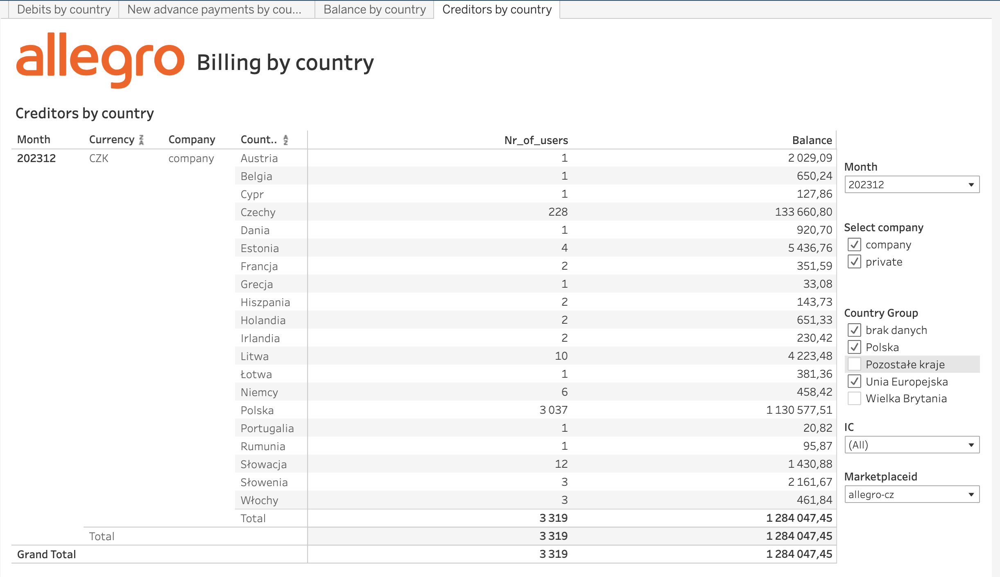

# Zatory Platnicze

### Zadania
[NYKS-45](https://jira.allegrogroup.com/browse/NYKS-45)
[NYKS-467](https://jira.allegrogroup.com/browse/NYKS-467)
[NYKS-739](https://jira.allegrogroup.com/browse/NYKS-739)


### Załozenia raportu

#### [2024-03-10]

#### Sprawdzenie danych:

#####  Sprawdzamy sekcje "Wpłaty otrzymane w 2023 roku"
 Sprawdzamy sekcje "Wpłaty otrzymane w 2023 roku" (wiersz 9 w excelu) dla np. allegro.cz z [raportem](https://tableau.allegrogroup.com/t/Finance/views/Billingbycountry/Creditorsbycountry) zafiltorwanym zgodnie z obrazkiem:

  { width="800"}

  Ponizej kod do wygenerowania detalicznych danych po stronie raportu w tableau.
  <details> 
    <summary>Kliknij, aby zobaczyć kod</summary>

  ```sql
  --Creditors by country--

  CREATE TABLE `sc-10231-finance-bq-dev.kubansa.balance_creditors`
  --PARTITION BY _PARTITIONDATE
  OPTIONS(
    --expiration_timestamp = TIMESTAMP "2028-01-01 00:00:00 UTC",
    description="Tabela tymczasowa",
    labels=[("allegro__pers__id_data", "0"), ("allegro__pers__sensitive_data", "0"), ("allegro__dgov__days_to_expire", "5"), ("allegro__dgov__trunc_dataset", "0"),("allegro__dgov__undeletable", "1")]
  ) as 

  WITH balance_creditors AS (
  SELECT DISTINCT
    CAST(userid AS NUMERIC) AS userid,
    DATE(SUBSTR(balancedate, 1, 10)) AS bi_month,
    CAST(balance AS NUMERIC) AS balance,
    marketplaceid,
    currency
  FROM `sc-9620-datahub-stream-prod.datahub.pl_allegro_finance_billingfour_monthlysummarycreatedv4`
  WHERE _partitiondate = '2024-01-01'
    AND CAST(balance AS NUMERIC) > 0
  ),

  users as
  (
        select
              distinct cast(user_id as numeric) as account_id,
              case
                  when cleared.topic_timestamp is not null then 'cud'
                  when cleared.user_cud_timestamp is not null then 'cud'
                  when flags.account_closed then 'closed'
                  when flags.account_resolved then 'contract_resolved'
                  when flags.account_terminated then 'contract_terminated'
                  when flags.account_blocked then 'blocked'
                  when flags.account_frozen then 'frozen'
                  when flags.account_paused then 'paused'
              else 'active'
              end  as account_status,
              if(flags.company, 'company', 'person') as account_type,
              lower(address.country_code) as residence_country_code,
              ifnull((case when flags.verified_company then 1 else 0 end),0) as verifiedcompany
          from
            `sc-9369-dataengineering-prod.users.users`
          where
              _partitiondate = '2023-12-31'
  ),
  countries as (
      select distinct 
          cn_iso_name as iso_name,
          cn_country_name as country_name,
          case 
              when cn_country_name in ('Austria', 'Belgia', 'Bułgaria', 'Chorwacja',
                                      'Cypr', 'Czechy', 'Dania', 'Estonia', 'Finlandia',
                                      'Francja', 'Grecja', 'Hiszpania', 'Holandia', 'Irlandia',
                                      'Litwa', 'Luksemburg', 'Malta', 'Niemcy', 'Polska',
                                      'Portugalia','Rumunia','Szwecja','Słowacja', 'Słowenia',
                                      'Węgry', 'Włochy','Łotwa') then 'EU'
              else 'NONEU' end as country_group
      from
          `sc-9369-dataengineering-prod.dwh_import.tl_ga6_country_names`
      where
          cn_country_name <> "Jan Mayen"
  ),
  users_join as(
      select
          account_id,
          account_status,
          account_type,
          residence_country_code,
          verifiedcompany,
          iso_name,
          country_name,
          country_group
      from
          users t
          left join countries tt on (t.residence_country_code = lower(tt.iso_name))
  )
  select
      date_trunc(cast(bi_month as date), month) as bi_month,
      userid,
      iso_name as iso_name,
      country_name as country_name,
      country_group as country_group,
      us_company as us_company,
      sum(balance) as balance,
      current_date() as date_insert_row,
      marketplaceid,
      currency,
      is_IC
  from
      (
          select
              bi_month as bi_month,
              t1.userid as userid,
              ifnull(iso_name, "brak danych") as iso_name,
              ifnull(country_name, 'brak danych') as country_name,
              case
                  when country_group = "EU" then case
                      when country_name = "Polska" then "Polska"
                      else "Unia Europejska"
                  end
                  when country_group = "NONEU" then case
                      when country_name = "Wielka Brytania" then "Wielka Brytania"
                      else "Pozostałe kraje"
                  end
                  else "brak danych"
              end as country_group,
              cast(
                  ifnull(cast(verifiedcompany as numeric), 0) as string
              ) as us_company,
              sum(balance) as balance,
              t1.marketplaceid,
              t1.currency,
              CASE WHEN t3.userid IS NOT NULL THEN 'IC' ELSE 'External' END AS is_IC
          from
              balance_creditors t1
              left join users_join t2 on t1.userid = t2.account_id
              LEFT JOIN `sc-10231-finance-bq-prod.general_finance.ic_companies_userid_daily` t3 ON (t1.userid = CAST(t3.userid AS NUMERIC) AND t3.dt = '2023-12-31')
          group by
              bi_month,
              userid,
              iso_name,
              country_name,
              country_group,
              us_company,
              marketplaceid,
              currency,
              is_IC
      )
  where
      balance <> 0
  group by
      bi_month,
      userid,
      iso_name,
      country_name,
      country_group,
      us_company,
      marketplaceid,
      currency,
      is_IC

  ```
  </details>

  </br>
  </br>
  Tu kod po stronie zatorow do porownania z raportem na tableau:
  <details>
  <summary> Kliknij, aby zobaczyć kod</summary>

  ```sql
  with dane as (

  select
  bf.userid,
  sum(debits_to_sum) debits, 
  sum(credits_to_sum) credits,
  sum(debits_to_sum) +sum(credits_to_sum) dif_deb_cred,
  sum(invoice_payment_0m_to_sum+ invoice_payment_14d_to_sum+ invoice_payment_5d_to_sum+ invoice_payment_30_to_sum+ invoice_payment_30_60_to_sum+ invoice_payment_60_90_to_sum+ invoice_payment_90_120_to_sum+ invoice_payment__120_to_sum ) payments_all,

  case when 
  sum(credits_to_sum+ wplywy_na_plus_2022_to_sum+ wplywy_na_current_2022_to_sum -
  wplywy_na_plus_2023_to_sum - wplywy_na_current_2023_to_sum - 
  (case 
  when balance_na_plus_2023_to_sum - wplywy_na_plus_2023_to_sum > 0
  then balance_na_plus_2023_to_sum - wplywy_na_plus_2023_to_sum
  else 0
  end)
  -(invoice_payment_0m_to_sum+ invoice_payment_14d_to_sum+ invoice_payment_5d_to_sum+ invoice_payment_30_to_sum+ invoice_payment_30_60_to_sum+ invoice_payment_60_90_to_sum+ invoice_payment_90_120_to_sum+ invoice_payment__120_to_sum )) > 0 then
  sum(credits_to_sum+ wplywy_na_plus_2022_to_sum+ wplywy_na_current_2022_to_sum -
  wplywy_na_plus_2023_to_sum - wplywy_na_current_2023_to_sum - 
  (case 
  when balance_na_plus_2023_to_sum - wplywy_na_plus_2023_to_sum > 0
  then balance_na_plus_2023_to_sum - wplywy_na_plus_2023_to_sum
  else 0
  end)
  -(invoice_payment_0m_to_sum+ invoice_payment_14d_to_sum+ invoice_payment_5d_to_sum+ invoice_payment_30_to_sum+ invoice_payment_30_60_to_sum+ invoice_payment_60_90_to_sum+ invoice_payment_90_120_to_sum+ invoice_payment__120_to_sum )) end  as check_old_invoice_2,

  sum(wplywy_na_plus_2022_to_sum)wplywy_na_plus_2022_to_sum,
  sum(wplywy_na_current_2022_to_sum) wplywy_na_current_2022_to_sum,
  sum(wplywy_na_plus_2023_to_sum)wplywy_na_plus_2023_to_sum,
  sum(wplywy_na_current_2023_to_sum)wplywy_na_current_2023_to_sum,
  sum(
  case 
  when balance_na_plus_2023_to_sum - wplywy_na_plus_2023_to_sum > 0
  then balance_na_plus_2023_to_sum - wplywy_na_plus_2023_to_sum
  else 0
  end) as sum_balance_na_plus_2023_NEW

  from  `sc-10231-finance-bq-dev.billing.before_final_2023` bf
      join `sc-10231-finance-bq-dev.billing.users_2023` u
      on bf.userid=u.userid 
  where marketplaceid = 'allegro-cz'
  and invoice_date between '2023-01-01' and '2024-01-01'
  group by 1 
  )
  ,

  dane2 as (
  select *, ifnull(debits,0)+ifnull(payments_all,0)+ ifnull(check_old_invoice_2,0) as check_wy from dane 
  )


  select * from dane2 where userid = '114477385'
  order by check_wy

  ```

  </details>

***

</br>


